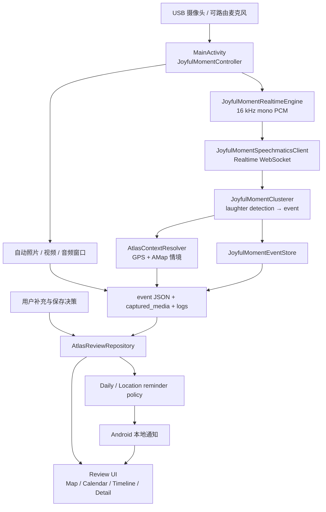

# Atlas of Happiness 2.0

<p align="center">
  
</p>

Atlas of Happiness 2.0 是一个 Android 研究原型：在用户主动开始的一段记录期间，
被动捕捉包含 laughter 的 positive moments，以笑声作为索引组织情境信息，并在用户
授权后通过短期、长期和同地点提醒帮助 moment resurfacing。

> [!IMPORTANT]
> 当前合作开发版本位于 `fj_ver`，基于 `user-study-prototype` 下的 2.0 架构继续开发。
> `master` 分支下的 1.1 不是最新版。

本 README 面向合作开发者，重点说明当前 App 的功能、页面、输入输出、数据结构和代码
入口。“推送”或 resurfacing 在本项目中指 Android 本地通知，不是服务器远程推送。

## 项目定位

Atlas 不是“笑声地图”，而是一个 **laughter-indexed positive moments resurfacing
system**。地图只是用户回顾历史 moment 的一种入口。

系统的核心边界如下：

- 用户明确开始、结束一次记录；记录期间的笑声检测与情境采集自动进行。
- 每个 laughter moment 都可以补充文字、语音、照片和社交情境。
- 用户决定删除、保留并允许回顾建议（`save_push`），或保留但不参与通知
  （`save_no_push`）。
- 回顾详情页只在 App 播放时增强过小的 laughter audio；原始研究 WAV 永不改写。
- 自动采集与回顾详情使用同一套 session 对齐的 `clip × 3` 窗口；默认 clip 为
  30 秒，因此默认窗口为 90 秒。
- 每个含 laughter 的窗口只展示一次对应的固定 2 张照片 + 1 段视频采集 bundle；
  同一窗口内的多段 laughter 并列播放，媒体和 longer audio 不跨窗口复用。
- 数据以本机 JSON 与媒体文件为 source of truth；当前没有账户、云同步或跨设备恢复。

## 核心用户流程

1. 在“记录”页连接并预览 USB 摄像头，输入参与者编号后开始记录。
2. `JoyfulMomentRealtimeEngine` 采集 16 kHz、单声道 PCM，并通过 Speechmatics
   WebSocket 接收 laughter events。
3. 符合阈值的检测由 `JoyfulMomentClusterer` 聚合成 moment；系统自动保留相关音频窗口，
   并按限频策略采集照片、视频，同时记录媒体的实际采集时间。
4. `AtlasContextResolver` 获取 GPS，并通过 AMap 完成坐标转换、逆地理编码和天气补充。
5. 用户手动结束记录后，从本次 session 中选择 moment，回答“和谁”“在做什么”
   “当时的心情”三个可跳过问题。
6. 用户对该 moment 选择：
   - **删除**：永久删除事件 JSON 与 App 管理的关联媒体；
   - **保存，并允许推送回顾建议**：写入 `save_push`；
   - **保存，但不推送回顾建议**：写入 `save_no_push`。
7. 已保存 moment 可在地图、日历和时间线中查看，并可继续编辑或删除；详情页按
   session 对齐的 `clip × 3` 窗口聚合 laughter、媒体和 longer audio，过小的
   laughter audio 会生成仅供播放的增强缓存。
8. 只有 `save_push` moment 能进入 Short、Long 和 Location resurfacing。

## 主要页面与功能

底部导航由“记录 / 回顾 / 我的”三个主入口组成。

| 页面 | 类 | 主要职责 |
| --- | --- | --- |
| 记录 | `MainActivity` | USB 摄像头预览、开始/结束记录、采集状态、今日统计、最近 moment |
| 记录后选择 | `SupplementPickerActivity` | 列出刚结束 session 中捕捉到的 laughter events |
| 主观补充 | `EventSupplementActivity` | 三个可选情境问题，以及 delete / `save_push` / `save_no_push` 决策 |
| 回顾 | `ReviewShellActivity` | Map、Calendar、Timeline 三种浏览方式；接收地点通知的地图聚焦参数 |
| Moment 详情 | `EventDetailActivity` | Short/Long reconstruction；按 `clip × 3` 窗口并列播放多段 laughter、查看单一 2+1 媒体 bundle 与 longer audio；编辑补充内容；永久删除事件 |
| 我的 | `MeActivity` | 系统/中文/英文切换；独立控制“每日回顾推送”和“同地点提醒”，两项默认开启 |
| 开发者设置 | `SettingsActivity` | 检测等级、Speechmatics、采集、情境 API 和摄像头参数 |
| 日志 | `LogViewerActivity` | 查看 session、Speechmatics、检测和 App 诊断日志 |
| 媒体查看 | `FullscreenPhotoActivity` / `VideoPlayerActivity` | 全屏照片与视频播放 |

## 系统架构与数据流



主要分层：

- **采集与检测**：`MainActivity`、`JoyfulMomentController`、
  `JoyfulMomentRealtimeEngine`、`JoyfulMomentSpeechmaticsClient`。
- **聚合与持久化**：`JoyfulMomentClusterer`、`JoyfulMomentEventStore`。
- **情境补全**：`AtlasContextResolver`。
- **读取与编辑**：`AtlasReviewRepository` 统一归一化新旧事件格式，并负责事件及媒体删除。
- **回顾与提醒**：`ReviewShellActivity`、`EventDetailActivity`、
  `AtlasResurfacingManager` 及 Daily/Location scheduler、receiver、policy classes。
- **播放与窗口聚合**：`AtlasLaughterPlaybackPreparer` 生成 App cache 播放副本；
  `AtlasMediaCaptureTimeResolver` 兼容新旧媒体时间；`AtlasClipMediaMatcher` 恢复
  固定 2 张照片 + 1 段视频 bundle；`AtlasResurfacingWindowAggregator` 按
  `AtlasAggregationBucketPolicy` 的 `clip × 3` 边界完成单一归属。

## 输入、处理与输出

| 阶段 | 输入 | 处理 | 输出 |
| --- | --- | --- | --- |
| 实时检测 | 16 kHz 单声道 PCM、Speechmatics Key 与网络 | WebSocket 流式识别；按置信度、时长阈值接收 laughter event | `speechmatics_raw.jsonl`、检测记录 |
| Moment 聚合 | laughter detection、相邻 audio clips | 按 event gap 聚合；保存 laughter 与可能相关语音窗口 | event JSON、WAV clips |
| 自动媒体 | USB 视频流、触发策略 | 每个 `clip × 3` bucket 最多创建一个固定 2 张照片 + 1 段视频 bundle，并记录 bundle 与 bucket 身份 | `captured_media/<event_id>/...`、`bundle_id`、`automation_bucket_*`、`capture_time_ms` |
| 自动情境 | GPS fix、AMap Key | GPS/WGS84 到 AMap 坐标、逆地理编码、天气查询；失败时重试或邻近事件回填 | `derived_context.gps`、`derived_context.weather` |
| 用户补充 | 文字、语音、照片、社交情境、保存决策 | 写入或编辑 `user_generated` 与 `save_decision` | JSON 更新、`user_generated/<event_id>/...` |
| 回顾 | 本地 JSON 与媒体 | 按历史 session 的 clip 时长构建 `clip × 3` 窗口；聚合多段 laughter、单一媒体 bundle 与不复用的 context audio；为过小 laughter audio 准备播放缓存 | 窗口卡片、Short/Long 详情、App cache 音频副本 |
| Resurfacing | `save_push` moments、时间、GPS、偏好和权限 | Daily 候选排序或 Location proximity policy | Android 本地通知与页面跳转 |

## Moment 数据结构

事件 JSON 位于某个 session 目录下。实际对象还包含 detection、媒体时间、session metadata
等字段；下面只展示协作开发最常用的归一化结构：

```json
{
  "event_id": "participant_event_...",
  "start_time_ms": 0,
  "end_time_ms": 0,
  "period_ids": [],
  "auto_captured": {
    "audio_clips": [
      {
        "type": "laughter",
        "path": "...",
        "device_time_ms": 0
      }
    ],
    "photos": [
      {
        "photo_path": "...",
        "capture_time_ms": 0,
        "bundle_id": "event-7_capture_1785295800000_bucket_12",
        "bundle_trigger_time_ms": 1785295800000,
        "bundle_media_index": 0
      }
    ],
    "videos": [
      {
        "video_path": "...",
        "capture_time_ms": 0,
        "bundle_id": "event-7_capture_1785295800000_bucket_12",
        "bundle_trigger_time_ms": 1785295800000,
        "bundle_media_index": 0
      }
    ]
  },
  "derived_context": {
    "gps": {},
    "weather": {}
  },
  "user_generated": {
    "notes": [],
    "audio_notes": [],
    "photos": [],
    "social_context": {
      "with_whom": "",
      "doing_what": "",
      "mood": ""
    }
  },
  "save_decision": {
    "action": "save_push"
  }
}
```

保存决策的语义：

| 决策 | 是否可在 App 内回顾 | 是否可参与通知 |
| --- | --- | --- |
| `save_push` | 是 | 是 |
| `save_no_push` | 是 | 否 |
| 删除 | 否 | 否；不会留下可回顾的 `delete` 记录，事件及 App 管理的媒体会被物理删除 |

## 笑声播放增强与媒体关联

### App 内笑声音量增强

增强只作用于 `laughter_audio` 的 App 播放过程，不作用于录制输入、用户语音补充或导出
数据，也不会覆盖原始 WAV：

1. 后台解析 PCM 16-bit little-endian WAV；
2. 使用 `20 ms` 帧中响度最高 `5%` 的平均 RMS 判断笑声主体，减少前后静音的影响；
3. 有效响度达到 `-24 dBFS` 时保持 `0 dB`，更小时补偿到阈值差值的 `75%`；
4. 增益始终不小于 `0 dB`，最大 `+18 dB`，因此不会主动调低任何 clip；
5. 超过约 `-1 dBFS` 的峰值进入连续软保护，降低削波和爆音风险；
6. 增强副本写入 App cache；解析或缓存失败时直接播放原 WAV。

该曲线会缩小过大的响度差距，但仍保持原始强弱次序，不会把所有笑声归一化成相同
音量。波形继续读取原始 WAV，以保留真实声音形状。研究交互日志的播放事件会记录
`gain_db` 和 `gain_algorithm_version`，但不记录音频内容。

核心参数位于
[`AppConfig.java`](atlasapp/src/main/java/com/hry/camera/usbcamerademo/AppConfig.java)，
实现位于
[`AtlasLaughterGainPolicy.java`](atlasapp/src/main/java/com/hry/camera/usbcamerademo/AtlasLaughterGainPolicy.java)
和
[`AtlasLaughterPlaybackPreparer.java`](atlasapp/src/main/java/com/hry/camera/usbcamerademo/AtlasLaughterPlaybackPreparer.java)。

### `clip × 3` 回顾窗口与媒体关联

采集和详情展示共享从 session 起点开始的固定 bucket 边界。窗口时长不是硬编码
90 秒，而是 `sessionClipDurationSec × 3`；默认 `30 × 3 = 90` 秒。只有包含至少
一段 laughter 的 bucket 才生成回顾卡片：

- 同一窗口内可包含多段 laughter audio，并按时间顺序分别提供播放、波形和进度；
- 左侧时长徽标是窗口内 laughter event 区间去重后的总时长，不是补齐后 WAV 时长；
- 每个 bucket 最多展示一个自动采集 bundle，bundle 固定最多 2 张照片和 1 段视频；
- bundle 部分采集失败时只展示成功项，不从其他 bundle 补齐，也不复制到相邻窗口；
- `possible_related_speech_context` 优先跟随显式关联的 laughter，旧数据才按 clip
  距离回退，并且只显示一次；不会生成只有 context、没有 laughter 的孤立卡片；
- 路径失效、session 时间无法可信恢复的内容不会被强行归属；
- Short 默认顺序为 laughter → 媒体 → 日期/地点 → longer audio；折叠区为
  Social context 与 User summary；
- Long 默认顺序为 laughter → 日期/地点；同一个折叠区依次包含媒体、
  longer audio、Social context 与 User summary。

新采集数据保存明确的 `bundle_id`、`bundle_trigger_time_ms`、
`bundle_media_index` 和 `capture_time_ms`。读取旧 event 时，时间恢复优先使用已有字段，
其次识别 `event_photo_<毫秒>` / `event_video_<毫秒>` 文件名，最后只接受落在 event
前后合理范围内的文件修改时间；没有 `bundle_id` 的旧媒体再按 15 秒窗口恢复 2+1
采集组。无法可信恢复时保持未知，不伪造为 event 开始时间。

### “笑声涟漪”图标

launcher、圆形 launcher、应用内笑脸、底部笑声导航和通知栏小图标已统一为对称笑脸与
双层扩散弧线。中心笑脸表示 laughter-indexed positive moment，弧线同时表达声音传播
与过去回忆再次浮现。Android 8.0 及以上使用 adaptive icon，旧版本使用五档密度 PNG；
通知使用符合 Android 状态栏规则的单色图标。

## Resurfacing 机制

两类提醒默认开启，可在“我的”中分别关闭。它们使用独立的 Android notification
channel；Short 与 Long 还使用不同 notification ID，因此同一天可在通知栏中分别出现。

### Basic：每日回顾

系统每天按本地时区约 `19:30` 调度两类候选，某类没有符合条件的数据时不会发送空通知。

| 类别 | 查询窗口 | 通知 ID | 文案方向 | 点击行为 |
| --- | --- | ---: | --- | --- |
| Short | 昨天这个日历日 | `2101` | “昨天 20:36，一段笑声” | 打开该 moment，并强制使用 Short detail |
| Long | 7 个日历日前 | `2102` | “一周前的这时候，你在……” | 打开该 moment，并强制使用 Long detail |

每类候选独立筛选，顺序为：

1. 只保留 `save_push`；
2. 只保留目标日历日；
3. 优先用户主动补充过的 moment；
4. 同一层级优先媒体总数更多的 moment；
5. 再优先发生时间最接近目标日 `19:30` 的 moment；
6. 最后以 `eventId` 保证结果确定。

可靠性措施包括：one-shot alarm 每次触发后重算下次本地时间；精确闹钟不可用时回退到
inexact alarm；异常后每 15 分钟重试、最多 2 次；App 启动以及重启、系统时间/时区变化、
App 更新后重新 reconcile；Short/Long 分别记录当日本地日期，防止重复发送。

### Special：同地点提醒

Location reminder 先将符合条件的历史 GPS 点聚合为稳定地点，再注册 Android
`LocationManager` proximity alert。真正发通知前会再次检查所有 policy gate：

- 支撑该地点的 moment 必须是 `save_push` 且至少已过去 `6 h`；
- 当前地点与历史地点中心的距离不超过 `50 m`；
- 同一地点在同一个本地日最多提醒一次；
- 任意两条地点通知之间至少间隔 `2 h`；
- 定位和通知权限仍有效，提醒开关仍开启。

通知不指向某一条 moment，文案为“这个地方留下过一些笑声回忆”。点击后打开 Map View，
并传入地点中心和半径，让地图直接聚焦该区域，用户自行浏览附近的历史 moments。

上述参数集中在
[`AppConfig.java`](atlasapp/src/main/java/com/hry/camera/usbcamerademo/AppConfig.java)，
不要在 receiver 或 UI 中重复硬编码。

## 代码导航

| 路径/类 | 作用 |
| --- | --- |
| [`atlasapp/src/main/java/com/hry/camera/usbcamerademo`](atlasapp/src/main/java/com/hry/camera/usbcamerademo) | App 页面、moment pipeline、repository、提醒系统 |
| [`MainActivity.java`](atlasapp/src/main/java/com/hry/camera/usbcamerademo/MainActivity.java) | 主页面、USB 采集宿主和 session 生命周期 |
| [`JoyfulMomentController.java`](atlasapp/src/main/java/com/hry/camera/usbcamerademo/JoyfulMomentController.java) | 检测、聚合、自动媒体、情境解析的协调器 |
| [`AtlasReviewRepository.java`](atlasapp/src/main/java/com/hry/camera/usbcamerademo/AtlasReviewRepository.java) | 事件读取、格式归一化、编辑、删除 |
| [`AtlasLaughterPlaybackPreparer.java`](atlasapp/src/main/java/com/hry/camera/usbcamerademo/AtlasLaughterPlaybackPreparer.java) | PCM16 WAV 响度分析、正增益和 App cache 播放副本 |
| [`AtlasAggregationBucketPolicy.java`](atlasapp/src/main/java/com/hry/camera/usbcamerademo/AtlasAggregationBucketPolicy.java) | 采集与展示共用的 session 对齐 `clip × 3` 窗口边界 |
| [`AtlasClipMediaMatcher.java`](atlasapp/src/main/java/com/hry/camera/usbcamerademo/AtlasClipMediaMatcher.java) | 收集显式 2+1 bundle，并按 15 秒窗口兼容旧媒体分组 |
| [`AtlasResurfacingWindowAggregator.java`](atlasapp/src/main/java/com/hry/camera/usbcamerademo/AtlasResurfacingWindowAggregator.java) | 多 laughter、单一媒体 bundle 与 context audio 的确定性窗口归属 |
| [`AtlasMediaCaptureTimeResolver.java`](atlasapp/src/main/java/com/hry/camera/usbcamerademo/AtlasMediaCaptureTimeResolver.java) | 新旧媒体可信采集时间解析 |
| [`AtlasResurfacingManager.java`](atlasapp/src/main/java/com/hry/camera/usbcamerademo/AtlasResurfacingManager.java) | Daily 与 Location reminder 的统一 reconcile 入口 |
| [`AtlasResurfacingSelector.java`](atlasapp/src/main/java/com/hry/camera/usbcamerademo/AtlasResurfacingSelector.java) | `save_push` 资格与两段式候选排序 |
| [`AtlasNotificationHelper.java`](atlasapp/src/main/java/com/hry/camera/usbcamerademo/AtlasNotificationHelper.java) | 通知 channel、风格、文案和 deep link |
| [`AppConfig.java`](atlasapp/src/main/java/com/hry/camera/usbcamerademo/AppConfig.java) | 检测、采集、GPS、提醒等统一参数 |
| [`atlasapp/src/main/res`](atlasapp/src/main/res) | 页面布局、图标、双语 strings 和主题资源 |
| [`atlasapp/src/test`](atlasapp/src/test) | JVM 单元测试 |
| [`docs/superpowers`](docs/superpowers) | 已确认的功能设计与实施计划 |

本地事件根目录由 `getExternalFilesDir(null)` 决定，并在其下创建 `joyful_moment/`。典型结构：

```text
joyful_moment/
├── config.json
├── research_interaction_log.jsonl
└── session_YYYYMMDD_HHMMSS/
    ├── summary.json
    ├── <event_id>.json
    ├── speechmatics_raw.jsonl
    ├── detection_log.jsonl
    ├── period_log.jsonl
    ├── clips/
    ├── captured_media/<event_id>/
    └── user_generated/<event_id>/
```

请通过 `JoyfulMomentEventStore` 或 `AtlasReviewRepository` 修改这些数据，不要让 UI
自行拼接一套不一致的文件格式。

### 研究交互日志

`research_interaction_log.jsonl` 是供 14 天用户研究结束后分析 App 使用与交互行为的
本地追加日志。每一行都是一个可独立解析的 JSON 对象；App 不会将该文件上传到服务器。
它记录 session 运行时长、页面停留、补充步骤、详情展开、媒体播放、地图/回顾操作、
设置变化和通知响应等交互元数据。

完成播放会同时记录毫秒制 `duration_played` 和 `total_duration`，可计算实际播放比例；
兼容字段 `played_duration_ms` 和 `duration_ms` 继续保留。保存决策首次写
`is_update=false`，后续实际变化追加 `is_update=true`，旧日志行不会被覆盖。

`clip × 3` 回顾窗口改造没有改变该日志的文件路径、JSONL 追加方式、schema envelope、
事件名或既有属性名。`detail_section_expanded` / `detail_section_collapsed` 仍使用
`section_name=clip_details` 和匿名化的 `clip_id`，因此已有分析脚本不需要新增事件类型
或字段。需要注意统计口径：详情页现在一张卡代表一个聚合窗口，所以一次展开/折叠记录
对应一个窗口，而不是窗口中的每一段 laughter；窗口内每条 laughter 和 longer audio
的播放仍分别产生原有媒体播放事件，并继续记录实际播放时长与总时长。历史日志不会被
迁移或覆盖，新交互继续追加到同一个文件。

该研究日志不会写入用户回答文本、“和谁 / 在做什么 / 心情”的内容、转写文本、GPS
经纬度、地址、媒体内容或媒体文件路径。完整字段和分析口径见
[`docs/research-log-schema-v1.md`](docs/research-log-schema-v1.md)。

连接开启 USB debugging 的研究手机后，可在仓库目录执行：

```sh
adb pull \
  /sdcard/Android/data/com.hry.camera.atlasofhappiness/files/joyful_moment/research_interaction_log.jsonl \
  ./research_interaction_log.jsonl
```

检查导出的每一行是否均为合法 JSON：

```sh
python3 -c 'import json,sys; [json.loads(line) for line in open(sys.argv[1], encoding="utf-8") if line.strip()]; print("JSONL valid")' research_interaction_log.jsonl
```

卸载 App、清除 App 数据或部分系统清理操作可能删除该文件。用户研究结束时，应先导出
日志和所需 moment 数据，再卸载、重置或覆盖不同签名版本。

## 环境要求

当前项目是单 module、Java Android 工程：

| 项目 | 当前值 |
| --- | --- |
| Module | `atlasapp` |
| Application ID | `com.hry.camera.atlasofhappiness` |
| Version | `versionCode 20` / `versionName 2.0-main` |
| Android SDK | `minSdk 22` / `targetSdk 28` / `compileSdk 28` |
| Android Gradle Plugin | `3.2.1` |
| Gradle Wrapper | `4.10.1` |
| Java | Java；该旧版 Gradle/AGP 组合建议使用 JDK 8 |
| UI | Android Support Library `28.0.0` |
| Network | OkHttp `3.12.13` |

准备：

1. 安装 JDK 8 与 Android SDK 28；
2. 用 Android Studio 打开仓库，或在命令行设置 `JAVA_HOME` 和 `ANDROID_HOME`；
3. 确保 `local.properties` 中的 `sdk.dir` 指向本机 Android SDK；
4. 完整采集流程准备支持 Android USB Host 的真机和兼容 USB 摄像头；
5. 准备可用的 Speechmatics 与 AMap 凭据。

## API Key 配置

推荐通过环境变量提供构建期配置：

```sh
export SPEECHMATICS_API_KEY="..."
export SPEECHMATICS_RT_URL="wss://eu2.rt.speechmatics.com/v2"
export AMAP_API_KEY="..."
export OPENWEATHER_API_KEY="..."
```

也可在本机 `local.properties` 中使用以下属性；不要填写后提交：

```properties
speechmatics.api.key=
speechmatics.api.url=
amap.api.key=
openweather.api.key=
```

App 的“我的 → 开发者设置”还能保存设备侧 runtime override。当前
`AtlasContextResolver` 使用 **AMap** 完成坐标转换、逆地理编码和天气查询；
OpenWeather 配置入口仍被保留，但不在当前自动情境主链路中使用。

> [!CAUTION]
> 不要把真实 API Key 写入 README、源码、commit 或日志。`local.properties` 和
> `atlas_keys.properties` 即使出现在 `.gitignore` 中，也可能因历史上已被跟踪而继续进入
> diff；修改凭据前后必须检查 `git status` 和 `git diff`，优先使用环境变量。

## 构建与运行

由于仓库中的 `gradlew` 可能没有可执行位，以下命令统一通过 `sh` 调用：

```sh
# 编译 Debug APK
sh gradlew :atlasapp:assembleDebug

# 运行 JVM 单元测试
sh gradlew :atlasapp:testDebugUnitTest

# 同时测试并构建
sh gradlew :atlasapp:testDebugUnitTest :atlasapp:assembleDebug
```

Gradle 原始输出位于：

```text
atlasapp/build/outputs/apk/debug/atlasapp-debug.apk
```

Android Studio 中选择 `atlasapp` configuration 和真机后即可运行。没有 USB
摄像头或 Speechmatics Key 时可以浏览部分 UI，但无法完整验证 laughter capture pipeline。

## 获取与安装 APK

本轮 `fj_aggregate_ver` 合作测试 APK 的本地路径：

[`artifacts/Atlas-of-Happiness-2.0-three-clip-aggregate-fj_aggregate_ver-debug.apk`](artifacts/Atlas-of-Happiness-2.0-three-clip-aggregate-fj_aggregate_ver-debug.apk)

| 项目 | 值 |
| --- | --- |
| Build type | Debug 研究/测试包，不是正式 Release |
| Package | `com.hry.camera.atlasofhappiness` |
| 文件大小 | 约 4.4 MB |
| Source branch / commit | `fj_aggregate_ver` / `6e3593f` |
| SHA-256 | `11f4ea9fd2acfded631186fdeaba030beb5f5246edad776ee5bb9529d463ca34` |

> [!NOTE]
> 该 APK 当前位于维护者工作区的未跟踪 `artifacts/` 目录，没有随源码 push 到
> GitHub。因此远程协作者不能直接从仓库下载这个文件；请向维护者获取 APK，或 clone
> `fj_aggregate_ver` 后按“构建与运行”自行生成。若需要稳定公开下载，应另行上传到 GitHub Release。

获得 APK 后在手机安装：

1. 将上述 `.apk` 文件传到手机；
2. 在 Android 提示时，允许当前浏览器或文件管理器“安装未知应用”；
3. 打开 APK 完成安装，再启动 Atlas；
4. 按提示授予相机、麦克风、定位和通知权限；同地点提醒还需要后台定位权限。

也可以连接开启 USB debugging 的 Android 设备后，通过 ADB 安装或覆盖同签名版本：

```sh
adb devices
adb install -r artifacts/Atlas-of-Happiness-2.0-three-clip-aggregate-fj_aggregate_ver-debug.apk
```

如果设备上已有不同签名、但 package 相同的版本，Android 会拒绝覆盖。卸载旧版本会清除
该 App 的本地 moment 数据，处理前请先备份需要保留的研究数据。

## 权限与硬件

| 权限/能力 | 用途 |
| --- | --- |
| `CAMERA`、`RECORD_AUDIO` | 采集视频、PCM 及用户语音/照片补充 |
| USB Host | 连接外部 USB 摄像头；完整采集路径依赖兼容硬件 |
| `INTERNET` | Speechmatics WebSocket、AMap 地理与天气请求、地图资源 |
| Fine/Coarse Location | 自动情境与同地点匹配 |
| Background Location | App 不在前台时接收同地点 proximity event |
| `POST_NOTIFICATIONS` | Android 13+ 显示 Daily/Location 通知 |
| `RECEIVE_BOOT_COMPLETED` | 重启后恢复提醒调度 |
| Foreground Service / Wake Lock | 记录期间保持采集流程 |
| Storage / FileProvider | 保存 App 管理的 JSON 和媒体，并安全打开媒体 |

Location reminder 在真机上还会受到系统后台限制、定位开关、权限策略和厂商省电策略影响。
开发时应在目标型号上进行进入/离开地点、锁屏、重启和跨日 smoke test。

## 测试

运行全部 JVM 单元测试：

```sh
sh gradlew :atlasapp:testDebugUnitTest
```

当前专项测试覆盖：

- `AtlasLaughterGainPolicyTest`：只增不减、最大增益和输出响度顺序；
- `AtlasLaughterPlaybackPreparerTest`：PCM16 WAV 分析、缓存、原文件不变、峰值保护与安全回退；
- `AtlasAggregationBucketPolicyTest`：不同 clip 时长、精确窗口边界与非法输入；
- `AtlasClipMediaMatcherTest`：显式 2+1 bundle 收集、部分 bundle、稳定排序和旧数据 15 秒推断；
- `AtlasResurfacingWindowAggregatorTest`：多 laughter 聚合、时长并集、媒体/context 单一归属及边界；
- `AtlasResurfacingWindowPresentationTest`：Short/Long 默认与折叠顺序、动态音频容器布局契约；
- `AtlasMediaCaptureTimeResolverTest` / `JoyfulMomentMediaAssetTest`：新媒体时间持久化与旧时间恢复；
- `ResearchLogPropertiesTest`：播放完成时长别名、首次/更新决策和相同选择 no-op；
- `AtlasResurfacingSelectorTest`：`save_push` 资格、补充优先、媒体数量与确定性排序；
- `AtlasReminderScheduleTest`：19:30 调度、跨日和 DST 日历窗口、catch-up；
- `AtlasLocationReminderPolicyTest`：6 h 最小年龄与 2 h cooldown；
- `AtlasLocationClustererTest`：50 m 地点聚类、稳定 key、无 GPS/no-push 排除；
- `AtlasEventDeletionPathsTest`：App 管理媒体删除范围与目录越界防护。
- `ResearchJsonlWriterTest` / `ResearchLogRecordTest`：研究日志落盘、重试与 schema envelope；
- `ResearchSessionTimingTest` / `ResearchPlaybackTrackerTest`：session 与实际媒体播放时长。

当前 `fj_aggregate_ver` 的完整 debug JVM 测试共 `122` 项；最近一次完整运行与
`:atlasapp:assembleDebug --rerun-tasks` 均通过。

单元测试不能替代真机验收。涉及 USB、系统闹钟、通知权限、后台 GPS、地图 deep link
和进程重启的行为，必须在 Android 真机上验证。

## 常见问题与已知限制

### 为什么没有检测到 laughter？

依次检查 Speechmatics Key、Realtime URL、网络、麦克风权限、实际 routed audio device，
以及开发者设置中的 confidence、minimum duration 和语言参数。可在日志页查看
`speechmatics_raw.jsonl` 与 `detection_log.jsonl`。

### 为什么某天没有 Daily 通知？

Short 和 Long 独立查询。目标日没有 `save_push` moment 时，该类不会占位发送；通知权限
关闭、每日提醒开关关闭也会阻止发送。系统若延迟 alarm，会在 App/系统 lifecycle
reconcile 时尝试补偿。

### 为什么没有同地点提醒？

确认该地点至少有一条带有效 GPS、已满 6 h 的 `save_push` moment；同时检查 50 m
范围、当日同地点去重、全局 2 h cooldown、后台定位和通知权限。部分厂商系统需要关闭
针对 Atlas 的严格省电限制。

### 为什么地图或天气为空？

GPS 或 AMap Key 缺失、网络失败、定位精度不足时，情境可能为空。系统会有限次数重试，
也可能从 6 h 邻近窗口内已有情境的事件回填。当前天气主链路来自 AMap，不是
OpenWeather。

### 为什么某段笑声还是比较小？

App 只对低于 `-24 dBFS` 的 laughter clip 做部分正增益，最大为 `+18 dB`。它的目标是
让极小声音更容易听见，同时保留“自己较大、环境较小”等原始相对特征，而不是把所有
片段拉到同一音量。非 PCM16、损坏或无法建立缓存的 WAV 会安全回退到原文件。

### 为什么某个回顾窗口没有照片或视频？

媒体 bundle 必须能够可信归属到该 session 的同一个 `clip × 3` bucket，且文件当前
可访问。该窗口没有合格 bundle 时媒体区域不会显示，也不会拿相邻窗口或时间上很远的
event 媒体替代。

### 当前产品限制

- 这是 user-study prototype，不是 production app；
- 没有登录、云备份、服务端数据库或跨设备同步；
- laughter detection 依赖第三方实时服务和网络；
- 完整采集依赖指定 USB 摄像头/音频路由，不能只靠 emulator 验证；
- Debug APK 使用开发调试签名，不应作为应用商店发布包；
- 播放增强当前仅支持采集链路产生的 PCM 16-bit little-endian WAV；
- 删除 event 是不可撤销的物理删除。

## 数据与隐私

- JSON、媒体和日志默认写入 App 私有外部存储下的 `joyful_moment/`，回顾页面直接读取
  这些本地文件。
- PCM 音频会发送给 Speechmatics 做实时事件识别；坐标会发送给 AMap 获取地址和天气。
  研究部署前应确保参与者知情同意与第三方数据处理说明完整。
- Resurfacing 通知完全在设备本地计算和显示，不会把 moment 上传到 Atlas 自有服务器。
- `save_no_push` 只阻止通知资格，不等于删除数据。
- 永久删除会同时清理事件 JSON 和 App 管理范围内的关联媒体；卸载 App 也可能清除
  App-specific storage。
- 研究交互日志仅保存在手机本地；删除 moment 后，历史日志中的不透明 moment ID 和
  既有交互行仍会保留，以维持研究行为时间线。
- 导出前不要卸载或清除 App 数据；导出的 `research_interaction_log.jsonl` 仍属于研究
  数据，应按研究协议安全保存。
- 开发日志可能包含事件 ID、文件路径、定位状态和服务错误，分享日志前应脱敏。

## 协作约定

- 新功能和修复以 `user-study-prototype` 的 2.0 架构为基础，并在 `fj_ver` 上协作；
  不从 `master` 的 1.1 反向覆盖。
- 修改数据格式时，必须同步考虑 `AtlasReviewRepository` 的旧格式归一化与已有研究数据。
- 检测、调度、半径、cooldown 等参数统一放入 `AppConfig` 或对应配置类。
- Notification 行为需要保持 idempotent；只有 `post...()` 成功后才能持久化“已发送”状态。
- 不提交 API Key、参与者数据、设备日志、个人 SDK 路径或签名文件。
- 提交前至少运行 `testDebugUnitTest` 和 `assembleDebug`；涉及后台行为时补充真机 smoke test。
- 对事件删除、数据迁移和通知 policy 的改动应同时添加或更新单元测试。
