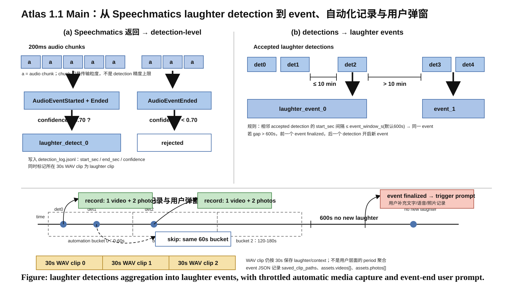

# Atlas of Happiness 1.1 Main：App Pipeline 与功能说明书

更新时间：2026-05-09  
App 目录：`android_apps/1.1_main`  
主 Android module：`atlasapp`  
包名：`com.hry.camera.atlasofhappiness`

这份文档说明 `1.1_main` 当前 Android App 的整体功能、实时检测 pipeline、聚合逻辑、自动化拍照/录像逻辑、用户弹窗逻辑、输出文件结构与测试方式。

> 当前版本的核心设计是：**只保留 detection-level 与 event-level 两层语义聚合**。  
> 30s `.wav` clip 仍然存在，但它是为了保存 laughter/context 音频，不再作为用户层面的 period 聚合层。



---

## 1. App 核心功能概览

`1.1_main` 是一个基于实时笑声检测的情境自动采集 App。它会在手机端持续采集音频，将音频流发送给 Speechmatics realtime API，接收 laughter audio event，并基于检测结果自动记录照片、视频和上下文音频。

主要功能包括：

1. **实时音频流式检测**
   - 使用 `AudioRecord` 采集 16kHz mono PCM。
   - 默认每 `200ms` 发送一个音频 chunk 到 Speechmatics realtime websocket。
   - Speechmatics 返回 `AudioEventStarted` / `AudioEventEnded`。

2. **detection-level 判断**
   - 只处理 Speechmatics 返回的 `type = laughter` event。
   - 在 `AudioEventEnded` 时得到完整 `start_time`、`end_time`、`confidence`。
   - 若 `confidence >= 0.7`，且满足最短时长阈值，则生成一个 laughter detection。

3. **event-level 聚合**
   - 相邻两个 accepted laughter detection 的 `start_sec` 间隔若 `<= 600s`，则放入同一个 laughter event。
   - 若间隔 `> 600s`，则关闭当前 event，并开启新 event。

4. **自动化记录**
   - accepted detection 会触发自动化记录，但不是每个 detection 都真正拍摄。
   - 当前自动化记录按 **2 个 audio clip** 节流。
   - 默认 clip 为 `30s`，因此每 `60s` 最多触发一次自动录像/拍照。
   - 每次有效触发默认产生：`1 个 video + 2 张 photo`。

5. **用户弹窗记录**
   - 用户弹窗不在 detection 到来时出现。
   - 弹窗在 **event 结束** 后出现。
   - event 结束条件包括：超过 600s 无新 laughter、下一个 detection gap 超阈值、用户停止 session、engine stop。

6. **上下文 `.wav` 保存**
   - App 仍按 30s 保存 local WAV clip。
   - laughter 所在 clip 会保存为 laughter clip。
   - 临近 speech context clip 可保存为 possible related speech context。
   - 这些 `.wav` 会挂到 event JSON 的 `saved_clip_paths`，并在 Review UI 中展示。

---

## 2. 当前两层聚合逻辑

当前 App 中有两个主要层级：

```text
Speechmatics raw messages
        ↓
detection-level: laughter_detect_i
        ↓
event-level: laughter_event_j
```

### 2.1 detection-level

Speechmatics 每次返回 laughter event 时，App 会先记录原始消息。

关键消息类型：

```text
AudioEventStarted
AudioEventEnded
```

`AudioEventStarted` 只表示 laughter 片段开始，App 会记录一个 detection edge。  
真正判断是否接受 detection 是在 `AudioEventEnded`。

原因是 `AudioEventEnded` 才有完整信息：

```text
start_time
end_time
confidence
duration = end_time - start_time
```

接受条件：

```text
confidence >= laughter_confidence_threshold_pct / 100
并且 duration >= laughter_min_duration_ms / 1000
```

默认值：

```text
confidence >= 0.70
min duration = 0 ms
```

accepted detection 示例：

```json
{
  "type": "detection.layer",
  "det_id": "det_000001",
  "device_time_ms": 1778302452747,
  "start_sec": 16.32,
  "end_sec": 17.04,
  "duration_sec": 0.72,
  "confidence": 0.91,
  "channel": "default"
}
```

rejected detection 会写入 `detection_log.jsonl`，常见 reason：

```text
confidence_below_threshold
duration_below_threshold
```

### 2.2 event-level

event 聚合规则：

```text
若 t(laughter_detect_i) - t(laughter_detect_{i-1}) <= event_window_s，
则 laughter_detect_i 归入当前 laughter_event。

否则，当前 event 结束，laughter_detect_i 开启新的 event。
```

默认：

```text
event_window_s = 600s = 10min
```

例子：

```text
det_0 start = 12s
    -> event_0000 starts

det_1 start = 42s
    -> 42 - 12 = 30s <= 600s
    -> det_1 belongs to event_0000

det_2 start = 700s
    -> 700 - 42 = 658s > 600s
    -> event_0000 finalized
    -> det_2 starts event_0001
```

---

## 3. 时间逻辑说明

当前默认时间参数：

| 逻辑 | 默认值 | 含义 |
|---|---:|---|
| audio chunk | 200ms | 发送给 Speechmatics realtime 的音频流粒度 |
| WAV clip | 30s | 本地保存 laughter/context `.wav` 的片段长度 |
| automation throttle | 60s | 2 个 clip 内最多触发一次自动拍照/录像 |
| auto video duration | 5s | 每次自动录像长度 |
| auto photo count | 2 | 每次自动触发拍照数量 |
| event gap | 600s | 相邻 detection 归入同一 event 的最大间隔 |
| user prompt | event end | event 结束后弹窗 |

注意：

```text
200ms chunk 只是网络流式传输粒度，不是检测时间精度上限。
```

Speechmatics 可以返回类似：

```text
start_time = 16.32
end_time = 17.04
```

这种细粒度时间，因为时间戳由 Speechmatics 后端模型在连续音频流上对齐生成。

---

## 4. 自动化记录逻辑

### 4.1 为什么不是每个 detection 都拍？

早期版本中，每个 accepted detection 都会触发自动拍照/录像。密集笑声场景下，这会导致 media 过多。

当前版本改为：

```text
accepted detection 仍然是自动化记录的候选触发点，
但真正执行拍照/录像前，会检查 automation bucket。
```

当前 bucket 长度：

```text
automation_bucket_sec = clip_duration_s * 2
```

默认：

```text
30s * 2 = 60s
```

因此：

```text
同一个 60s bucket 内，只允许一次自动化记录。
```

### 4.2 自动化记录内容

每次有效自动化触发：

```text
1 个 video
2 张 photo
```

默认参数：

```text
trigger_video_duration_s = 5
trigger_photo_count = 2
```

理想比例：

```text
video : photo = 1 : 2
```

如果视频录制失败、相机 busy、权限不足或外接 camera 未打开，比例可能偏离。相关原因会记录在 `detection_log.jsonl`。

### 4.3 video 多文件保存

event 支持保存多个 video：

```json
"assets": {
  "video": "最后一个 video path，保留兼容旧逻辑",
  "videos": [
    {"path": "...event_video_1.mp4", "content_uri": "..."},
    {"path": "...event_video_2.mp4", "content_uri": "..."}
  ],
  "photos": [
    "...event_photo_1.jpg",
    "...event_photo_2.jpg"
  ]
}
```

Review UI 中点击 video 时，默认使用系统/外部播放器打开，因为实测外部播放器对当前 MP4 兼容性更好。

---

## 5. 用户弹窗逻辑

用户输入弹窗用于 event-level reflection。

当前逻辑：

```text
不在 detection 到来时弹窗。
不在 automation 记录后弹窗。
只在 event finalized 后弹窗。
```

event finalized 的原因可能是：

1. 新 detection 与上一个 detection 的 gap `> 600s`。
2. 当前 event 已经 `600s` 没有新 laughter。
3. 用户手动停止 Joyful session。
4. realtime engine stopped。

弹窗触发后，用户可以进入 review/context 页面补充文字、音频或照片记录。

---

## 6. `.wav` context/laughter 保存逻辑

虽然 period 层已移除，但 App 保留 30s WAV clip 机制。

默认：

```text
clip_duration_s = 30
context_neighbor_clips = 2
```

clip 分类：

| label | 含义 |
|---|---|
| `laughter` | 该 30s clip 中包含 accepted laughter detection |
| `possible_related_speech_context` | laughter clip 附近的 speech context clip |
| `none` | 不保存 |

保存路径示例：

```text
session_xxx/clips/clip_000000_laughter.wav
session_xxx/clips/clip_000001_possible_related_speech_context.wav
```

挂载到 event JSON：

```json
"laughter_clip_ids": [0],
"context_clip_ids": [1],
"saved_clip_paths": [
  "/.../clips/clip_000000_laughter.wav"
]
```

`AtlasReviewRepository` 会把 `saved_clip_paths` 转换成 UI 可展示的：

```json
"auto_captured": {
  "audio_clips": [...]
}
```

---

## 7. 输出文件结构

手机端根目录：

```text
/sdcard/Android/data/com.hry.camera.atlasofhappiness/files/joyful_moment/
```

典型结构：

```text
joyful_moment/
  config.json
  dev_ui_log.txt
  session_YYYYMMDD_HHMMSS/
    summary.json
    speechmatics_raw.jsonl
    detection_log.jsonl
    event_log.jsonl
    event_0000.json
    clips/
      clip_000000_laughter.wav
      clip_000001_possible_related_speech_context.wav
    captured_media/
      event_0000/
        videos/
          event_video_TIMESTAMP.mp4
        photos/
          event_photo_TIMESTAMP.jpg
```

### 7.1 `speechmatics_raw.jsonl`

保存 Speechmatics 原始消息和 audio chunk 发送记录。

常见类型：

```text
audio.chunk.sent
speechmatics.message
engine.audio.input_devices
engine.audio.routed_device
engine.error
```

### 7.2 `detection_log.jsonl`

保存检测、过滤、自动化记录和 event finalized 信息。

常见类型：

```text
detection.edge.started
detection.layer
detection.rejected
automation.triggered_by_detection
automation.skipped_same_2clip_window
asset.auto_video.saved
asset.auto_photo.saved
event.finalized
```

### 7.3 `event_XXXX.json`

保存 event 当前状态，用于 Review UI。

核心字段：

```json
{
  "type": "event.layer",
  "event_id": "event_0000",
  "start_sec": 12.0,
  "end_sec": 42.0,
  "finalized": true,
  "aggregation_gap_threshold_sec": 600,
  "laughter_clip_ids": [0],
  "context_clip_ids": [1],
  "detection_ids": ["det_000001", "det_000002"],
  "saved_clip_paths": [...],
  "assets": {
    "video": "...",
    "videos": [{"path": "...", "content_uri": "..."}],
    "photos": ["..."]
  }
}
```

---

## 8. Settings 参数说明

Settings 会保存到 SharedPreferences，并镜像到：

```text
joyful_moment/config.json
```

| 参数 | 默认值 | 说明 |
|---|---:|---|
| `chunk_ms` | 200 | 发送给 Speechmatics realtime 的音频分块粒度 |
| `clip_duration_s` | 30 | 本地 laughter/context WAV clip 长度 |
| `context_neighbor_clips` | 2 | laughter 前后可保留为 context 的 clip 数量 |
| `event_window_s` | 600 | 相邻 detection 归入同一 event 的最大间隔 |
| `laughter_confidence_threshold_pct` | 70 | laughter detection 接受阈值 |
| `laughter_min_duration_ms` | 0 | laughter detection 最小时长；0 表示不启用 |
| `trigger_video_duration_s` | 5 | 每次自动录像长度 |
| `trigger_photo_count` | 2 | 每次自动拍照数量 |
| `speechmatics_language` | `en` | Speechmatics 语言 |
| `speechmatics_operating_point` | `enhanced` | Speechmatics operating point |
| `speechmatics_max_delay_s` | `null` | Speechmatics 最大延迟，可为空 |
| `speechmatics_event_types` | `laughter` | 请求的 audio event type |

---

## 9. Android Studio / 模拟器测试

### 9.1 打开项目

Android Studio 中打开：

```text
D:\Projects\laughter-detection\android_apps\1.1_main
```

目标 module：

```text
atlasapp
```

### 9.2 构建栈

当前工程使用老 Android 构建栈：

```text
Gradle wrapper: 4.10.1
Android Gradle Plugin: 3.2.1
compileSdkVersion: 28
targetSdkVersion: 28
```


```text
C:\Program Files\Eclipse Adoptium\jdk-8.0.482.8-hotspot
```

### 9.3 命令行 build

```powershell
cd D:\Projects\laughter-detection\android_apps\1.1_main
$env:JAVA_HOME='C:\Program Files\Eclipse Adoptium\jdk-8.0.482.8-hotspot'
$env:Path="$env:JAVA_HOME\bin;$env:Path"
.\gradlew.bat :atlasapp:assembleDebug
```

APK 路径：

```text
atlasapp/build/outputs/apk/debug/atlasapp-debug.apk
```

### 9.4 安装到模拟器

Debug APK 可能带 `testOnly` 标记，因此手动安装需要 `-t`：

```powershell
adb -s emulator-5554 install -r -t .\atlasapp\build\outputs\apk\debug\atlasapp-debug.apk
adb -s emulator-5554 shell monkey -p com.hry.camera.atlasofhappiness 1
```

模拟器可测试：

```text
App 启动
Settings 页面
Logs 页面
Review Hub 页面
无 USB camera/mic 时不 crash
```

模拟器不适合完整验证：

```text
USB camera
USB mic
Speechmatics 实时延迟
自动拍照/录像完整链路
```

完整流程仍建议使用真机。

---

## 10. 真机完整流程测试

推荐流程：

1. 安装 APK。
2. 手机 Type-C 连接外置 camera/mic。
3. 打开 App 并授予权限。
4. Preview 确认 camera feed。
5. Start Joyful。
6. 发出测试笑声。
7. 检查：

```text
Speechmatics 是否有 API 消耗
detection_log.jsonl 是否有 detection.layer
event_0000.json 是否生成
captured_media 中是否有 photo/video
clips 中是否有 laughter/context wav
Review UI 是否显示 photo/video/audio
video 是否用外部播放器正常打开
event 结束后是否弹出用户记录弹窗
```

拉取日志：

```powershell
adb pull /sdcard/Android/data/com.hry.camera.atlasofhappiness/files/joyful_moment phone_runs/device_debug
adb logcat -d > phone_runs/device_debug/logcat.txt
```

---

## 11. 关键代码文件

| 文件 | 作用 |
|---|---|
| `MainActivity.java` | UI、camera preview、自动拍照/录像、用户弹窗 |
| `JoyfulMomentController.java` | session 状态、Speechmatics 消息处理、detection 过滤、event 聚合、automation 触发、JSON 写入 |
| `JoyfulMomentRealtimeEngine.java` | AudioRecord 采集、USB mic 选择、Speechmatics websocket streaming、WAV clip 写入 |
| `JoyfulMomentSpeechmaticsClient.java` | Speechmatics realtime websocket 协议 |
| `JoyfulMomentWavClipWriter.java` | 本地 WAV clip 分段与 finalize |
| `JoyfulMomentClusterer.java` | DetectionRecord / EventRecord 数据模型 |
| `JoyfulMomentConfig.java` | Settings、preset、config 保存 |
| `AtlasReviewRepository.java` | event 文件读取与 UI 归一化 |
| `EventDetailActivity.java` | event 详情、媒体展示、用户补充记录 |
| `VideoPlayerActivity.java` | app 内 fallback video viewer 与诊断 |
| `AtlasForegroundService.java` | 前台服务、wake lock、Wi-Fi lock |
| `AtlasApplication.java` | 生命周期与 crash/dev 日志 |

---

## 12. 设计选择总结

1. **保留 detection + event 两层语义聚合**  
   不再把 period 暴露为用户层级。

2. **30s clip 仅用于音频上下文保存**  
   laughter/context WAV 仍然按 clip 保存，方便回看。

3. **automation 按 detection 触发、按 60s 节流**  
   保证靠近笑声发生时记录上下文，同时避免密集笑声产生过多媒体。

4. **用户弹窗只在 event 结束后出现**  
   避免用户在连续笑声过程中频繁被打断。

5. **video 默认用外部播放器打开**  
   当前 MP4 文件本身正常，但 Android 内嵌 `VideoView` 对不同设备/codec/surface 兼容性不稳定。

6. **Speechmatics 时间戳作为检测时间依据**  
   200ms chunk 是传输粒度，detection 的 `start_sec/end_sec` 使用 Speechmatics 返回的精细时间戳。
